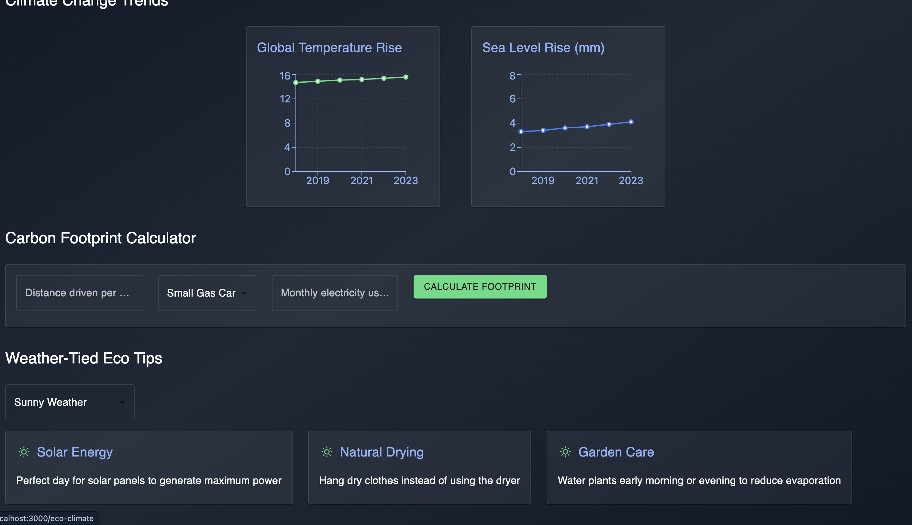

# Weather App

A comprehensive weather application built with React and Node.js that provides real-time weather information, climate trends, travel planning, and weather news.

## Demo Screenshots

### Homepage


### Weather Search


### Climate Trends


### Eco Climate


### Travel Planner


### Weather News


### User Authentication


## Features

- **Real-time Weather Search**: Get current weather conditions for any location
- **Climate Trends**: View historical climate data and trends
- **Travel Planning**: Plan your trips based on weather conditions
- **Weather News**: Stay updated with the latest weather-related news
- **User Authentication**: Secure login and registration system
- **Responsive Design**: Works seamlessly across all devices

## Tech Stack

### Frontend
- React.js
- Material-UI
- React Router
- Recharts (for data visualization)
- Axios

### Backend
- Node.js
- Express.js
- MongoDB
- JWT Authentication
- OpenWeatherMap API
- News API

## Prerequisites

- Node.js (v14 or higher)
- MongoDB Atlas account
- OpenWeatherMap API key
- News API key

## Environment Variables

Create a `.env` file in the backend directory with the following variables:

```env
PORT=4000
MONGO_URI=your_mongodb_connection_string
JWT_SECRET=your_jwt_secret
NEWS_API_KEY=your_news_api_key
WEATHER_API_KEY=your_openweathermap_api_key
```

## Installation

1. Clone the repository:
```bash
git clone https://github.com/yourusername/weather-app.git
cd weather-app
```

2. Install backend dependencies:
```bash
cd backend
npm install
```

3. Install frontend dependencies:
```bash
cd ../frontend
npm install
```

## Running the Application

1. Start the backend server:
```bash
cd backend
node server.js
```

2. Start the frontend development server:
```bash
cd frontend
npm start
```

The application will be available at:
- Frontend: http://localhost:3000
- Backend: http://localhost:4000

## API Endpoints

### Authentication
- POST `/api/auth/register` - Register a new user
- POST `/api/auth/login` - Login user

### Weather
- GET `/api/weather/search` - Search weather by location
- GET `/api/weather/forecast` - Get weather forecast

### Travel
- GET `/api/travel/location` - Get weather for travel location
- GET `/api/travel/compare` - Compare weather between destinations
- GET `/api/travel/suggestions` - Get travel suggestions
- GET `/api/travel/tips` - Get tourist tips

### News
- GET `/api/news` - Get weather-related news

## Acknowledgments

- OpenWeatherMap API for weather data
- News API for weather-related news
- Material-UI for the component library
- Recharts for data visualization